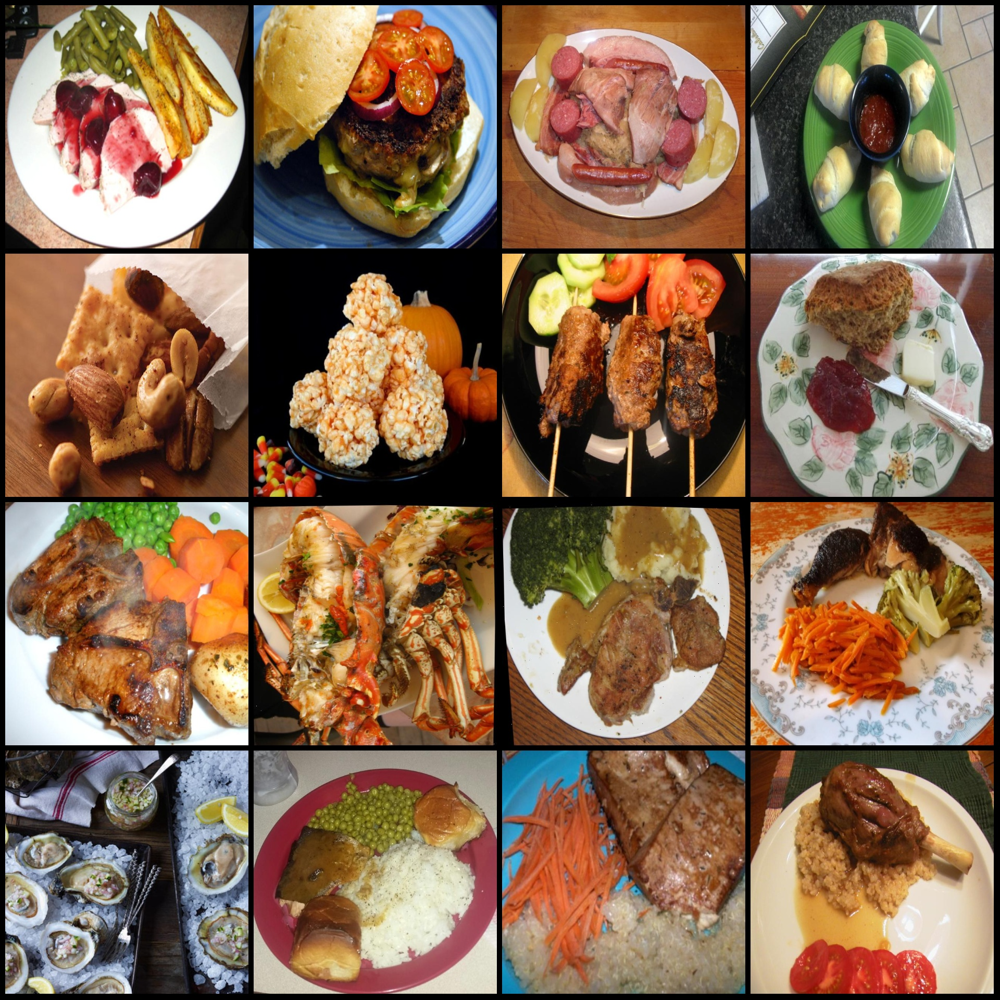
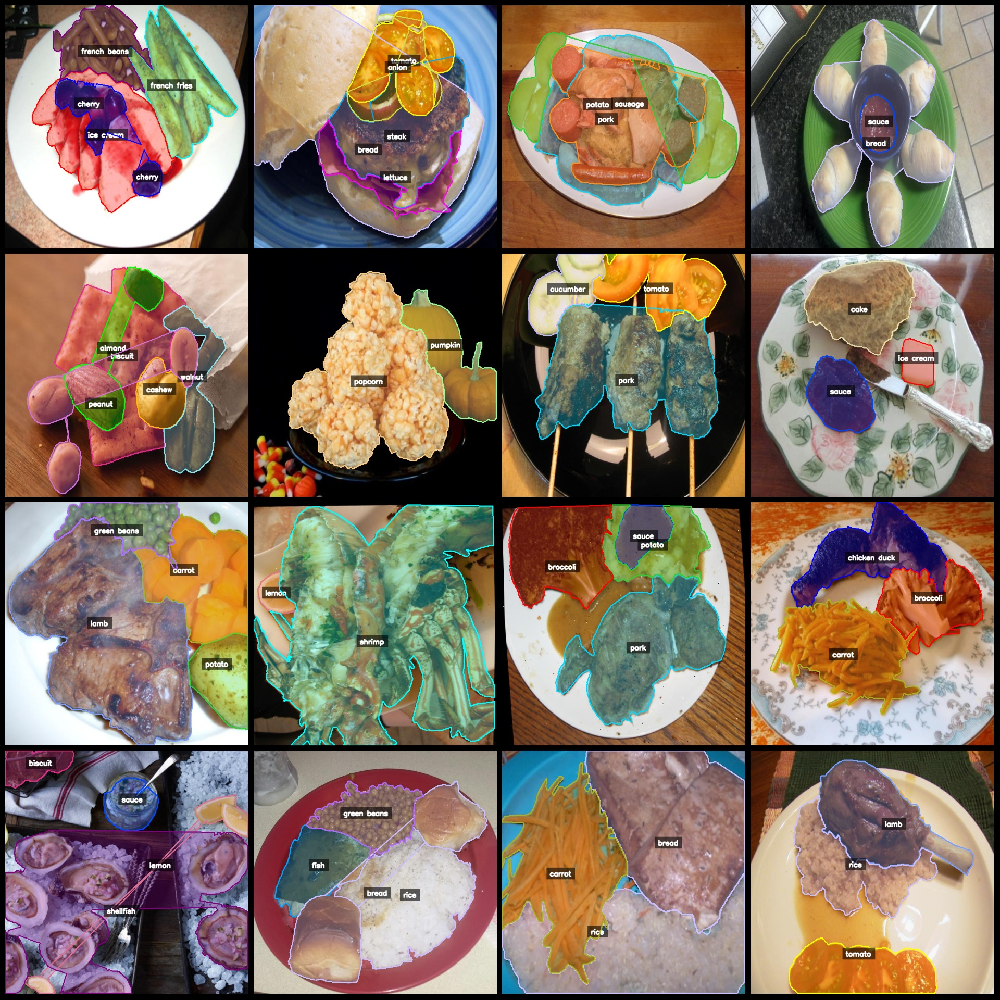
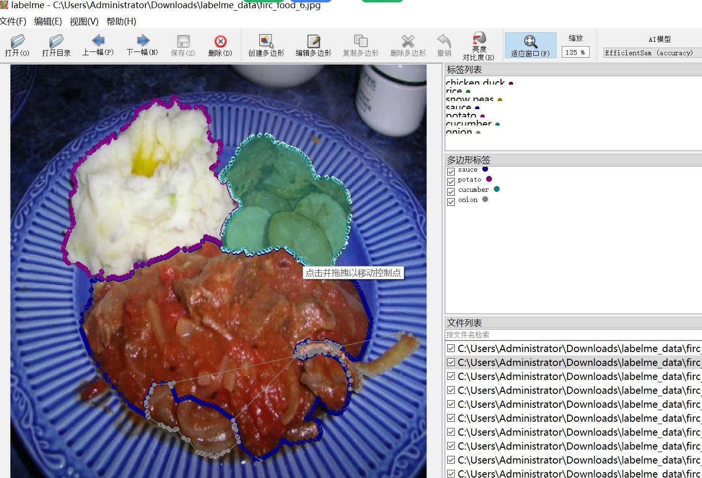

# Food Ingredients Identification Segmentation Dataset in LabelMe format with 7605 images and 103 categories

The dataset format is labelme, without the mask file, only containing jpg images and corresponding json files.

7605

Label count: 103 categories

Annotation Class Names List:
- almond
- apple
- apricot
- asparagus
- Avocado
- Bamboo shoots (Bamboo shoots)
- Banana (Banana)
- Bean sprouts (Bean sprouts)
- biscuit
- Blueberry
- Bread
- Broccoli
- Cauliflower
- cake
- Candy
- Carrots
- cashew
- Cauliflower (Cauliflower)
- Celery Stick (Celery Stick)
- Cheese Butter (Cheese Butter)
- Cherry (Cherry)
- Chicken/Duck (Chicken/Duck)
- Chocolate (Chocolate)
- cilantro mint
- coffee
- corn
- crab
cucumber
Date
- Cranberries (dried cranberries)
- Egg (egg)
- Egg Tart (egg tart)
- Eggplant (eggplant)
- Enoki Mushroom
- fig
- FISH
- FRENCH BEANS
- Fried Potatoes
- Garlic
- ginger
- grape
- Beans
- hamburg
- steamed bun / steamed dumpling
- Ice cream
- juice
- kelp
- king oyster mushroom
- kiwi
- lamb
- lemon
Lettuce
- mango
- Melon
- Milk
- Milkshake
- Noodles
Okra
- olive
- Onion
- Orange
- Other ingredients
- Oyster mushroom
- pasta
- peach
- peanuts
- pear
- Pepper/Chili
- pie
- Pineapple
- pizza
- popcorn
- Pork
- Potato
- Pudding
- Pumpkin
- Rape
- Raspberry
- Red Beans
- Rice
- Salad
sauce
- sausage
- seaweed
- shellfish
Shiitake mushroom
- shrimp
- Snow peas
- Soup
- Soy
- Spring onion
- Steak
- Strawberry
- Tea
- tofu
- tomato
- Walnut (walnut)
- Watermelon (watermelon)
- White button mushroom
- white radish
- wine
- Wonton dumplings

annotationtotal boxes: 28094
## Images

Here is a pay link on Stripe ( https://buy.stripe.com/3cs8yP7sY87d0vu9AB ). Please contact me lonlonago@foxmail.com after funding $89, and I will send you a complete data files , thank you!

